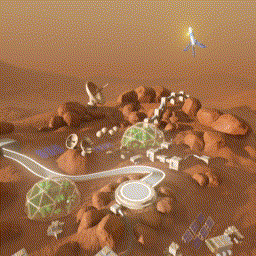

# Mars Lander environment example

A 3D landing challenge inspired by the classic 2D Lunar Lander. 

A lander starts at a random position around the landing base with a certain height. To add some extra difficulty, it also starts with a random tilt. The lander has 5 engines : one engine at the bottom and four auxiliary engines on the sides.

The goal is to land with the 4 pads on the landing area. The landing area center is at (0,0,0).

## Observations

Continuous `Box(10)` :

|Idx|Observation|Min|Max|
|-|-|-|-|
|0|X Position|-8|8|
|1|Y Position|0|14|
|2|Z Position|-8|8|
|3|X Velocity|-8|8|
|4|Y Velocity|-7|7|
|5|Z Velocity|-8|8|
|7|AuxX vertical projection|-1|1|
|8|AuxZ vertical projection|-1|1|
|9|AuxX vertical projection speed|-1|1|
|10|AuxZ vertical projection speed|-1|1|

Where 'AuxX vertical projection' is dot product between the AuxX engine fire direction vector and the world Y axis (vertical).

## Actions

`Box(6)` :

|Value|Action|
|-|-|
|0|Fire Main engine|
|1|Fire AuxX engine|
|2|Fire AuxXn engine|
|3|Fire AuxZ engine|
|4|Fire AuxZn engine|
|5|Fire no engine|

## Reward

Reward is :
`distance reward + tilt reward + landing reward`

where :
- `distance reward` inv. proportional to the distance between the lander and the landing area
- `tilt reward` proportional to the tilt angle of the lander
- `landing reward` proportional to the number of landing pad on the landing area.

## Episode Termination:

One the lander X, Y or Z position coordinate outside the limits.

## Learning script example

[learn.py](./learn.py) (to be launched from within the script's own folder), uses [Stable-Baseline](https://github.com/DLR-RM/stable-baselines3) & multi process vectorized environments.

