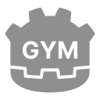
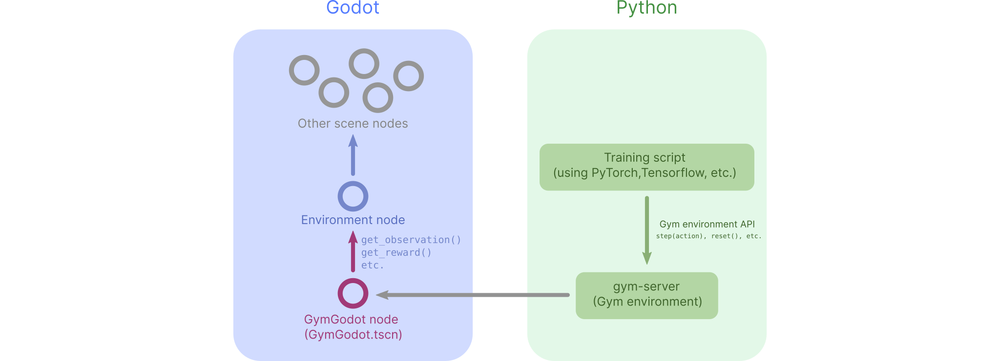
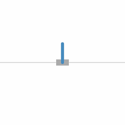
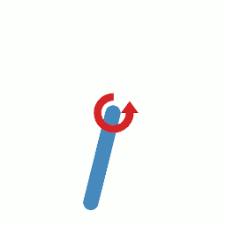

# GymGodot

[Godot Engine](https://godotengine.org/) as an [OpenAI Gym](https://github.com/openai/gym) environment for Reinforcement Learning.

## Overview

### `gym-godot` : Godot Side (client)
- The '_Environment node_', created by the user, implements the required methods (`execute_action()`, `get_observation()`, `get_reward()`, `reset()` and `is_done()`).
- The `GymGodot` node (`GymGodot.tscn`) bridges the '_Environment node_' node and the Python side server.

### `gym-server` : Python Side (server)
- `gym-server` communicates with its Godot client and exposes it as a Gym environment.

Communications between the server and client are done with WebSocket JSON messages ([protocol.md](protocol.md))

## Installation & Usage

- Download or clone this repo.
- Add `GymGodot.tscn`, `GymGodot.gd` and `WebSocketClient.gd` from `/godot-gym` to your Godot project folder. Then add the `GymGodot.tscn` node into your scene.
- Create a node (the '_Environment node_') that implements the required functions.
- In the inspector, set GymGodot Node's '_Environment Node_' property to your '_Environment node_'.
- On the python side, install gym-server with : `pip install -e gym-server`. Use it in your training script like a regular Gym environment.

A step-by-step tutorial is available in the [tutorial.ipynb](gym-godot/examples/cartpole/tutorial.ipynb) notebook.

## Example environments

### Cartpole

`godot-gym/examples/cartpole/`

Description : [cartpole.md](gym-godot/examples/cartpole/cartpole.md)

### Pendulum

`godot-gym/examples/pendulum/`

Description : [pendulum.md](gym-godot/examples/pendulum/pendulum.md)

### Mars Lander

Description : [mars_lander.md](gym-godot/examples/mars_lander/mars_lander.md)

## Notes

- Make sure to open the project ([gym-godot/project.godot](gym-godot/project.godot)) in the Godot Editor at least once before using the example environments (so that the resources are imported).

- Only tested on Linux & Godot 3.3.

- The code follows the Gym API so it might work with other Gym-compatible frameworks but has only been tested with [Stable-Baselines 3](https://github.com/DLR-RM/stable-baselines3).

- No current plan for further improvements, maintenance or support.